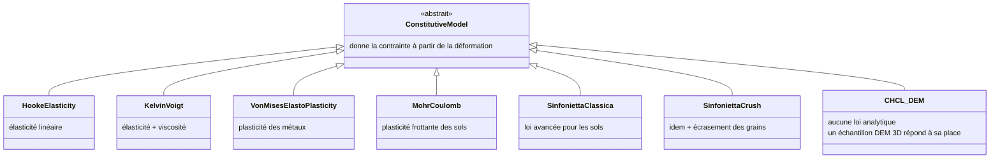
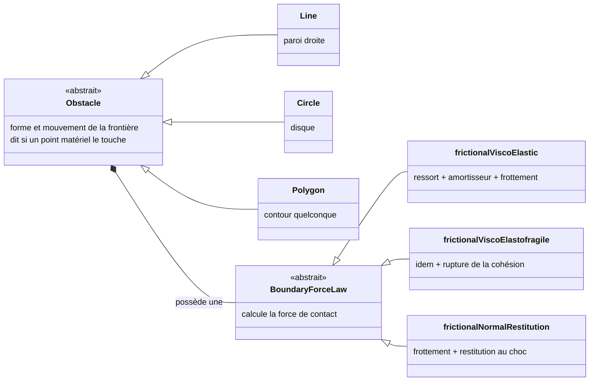
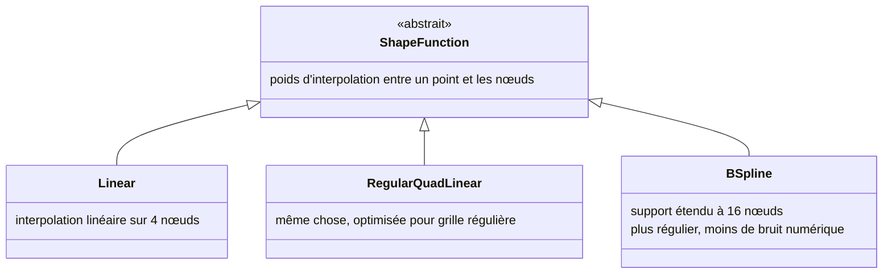
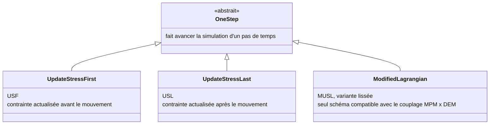
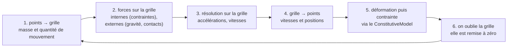
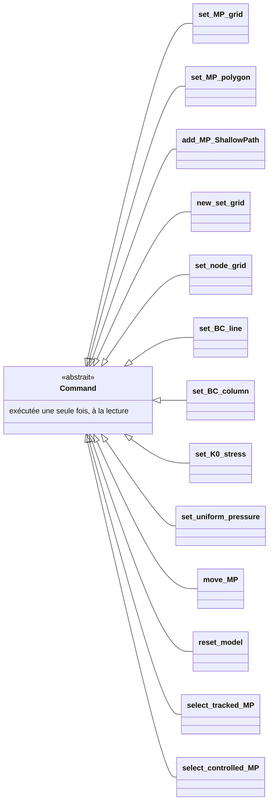
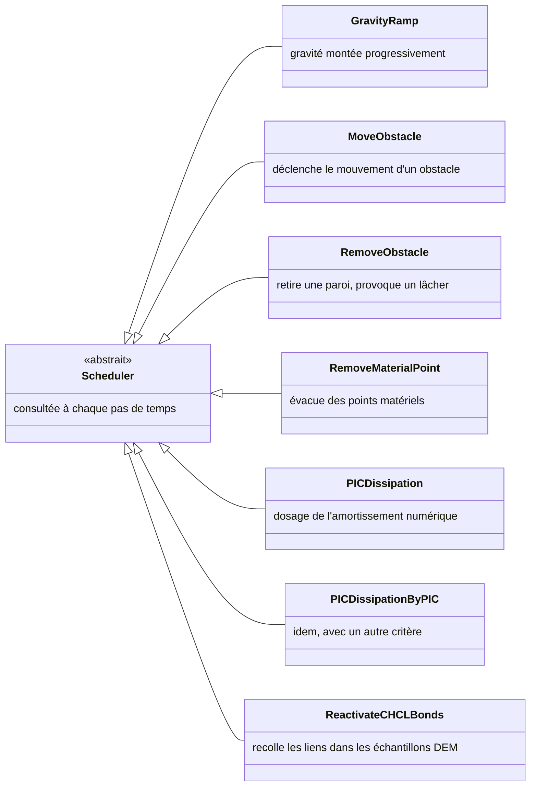
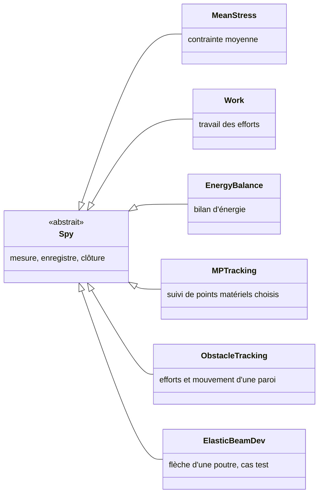

# Structure de MPMbox (2D)

Ce document décrit, dans les grandes lignes, comment le code est organisé.
L'idée directrice tient en une phrase :

> **MPMbox est un chef d'orchestre qui fait avancer une matière décrite par des
> points matériels sur une grille fixe, et tout ce qui relève d'un *choix de
> modélisation* est un ingrédient interchangeable, choisi par un mot-clé dans le
> fichier d'entrée.**

Chaque « famille » d'ingrédients possède une classe de base (le *contrat* : ce
que l'ingrédient doit savoir faire) et autant de variantes que de choix
disponibles. Ajouter une variante ne modifie pas le cœur du code.

---

## 1. Vue d'ensemble

```mermaid
flowchart TB
  BOX["<b>MPMbox</b><br/><i>le chef d'orchestre</i><br/>lit les données, boucle en temps, sauvegarde"]

  subgraph ETAT["Ce qui est simulé (les données)"]
    direction LR
    MP["<b>MaterialPoint</b><br/>points matériels lagrangiens<br/>masse, position, vitesse,<br/>déformation, contrainte"]
    GRID["<b>grid / node / element</b><br/>grille eulérienne fixe<br/>support des calculs de gradients"]
    OBS["<b>Obstacle</b><br/>corps rigides<br/>qui bornent l'écoulement"]
  end

  subgraph CHOIX["Ce que l'utilisateur choisit (les ingrédients)"]
    direction TB
    CM["<b>ConstitutiveModel</b><br/>comportement du matériau"]
    SF["<b>ShapeFunction</b><br/>transfert points &#8596; grille"]
    OS["<b>OneStep</b><br/>schéma d'intégration en temps"]
    BFL["<b>BoundaryForceLaw</b><br/>loi de contact aux obstacles"]
    CMD["<b>Command</b><br/>mise en données"]
    SCH["<b>Scheduler</b><br/>scénario au cours du temps"]
    SPY["<b>Spy</b><br/>mesures pendant le calcul"]
  end

  BOX --> ETAT
  BOX --> CHOIX
  MP -. "chaque point porte son" .-> CM
  OBS -. "chaque obstacle porte sa" .-> BFL
```

Ces sept familles sont toutes bâties sur le même patron : une classe de base
abstraite, des variantes concrètes, et un nom textuel qui permet de les demander
depuis le fichier d'entrée.

> Le répertoire `VtkOutputs/` existe dans l'arbre des sources mais n'est ni
> compilé (absent du `file(GLOB ...)` de `CMakeLists.txt`) ni accessible depuis le
> fichier d'entrée. Il n'est donc pas décrit ici.

---

## 2. Le comportement du matériau — `ConstitutiveModel`

C'est la physique du matériau : à partir de l'incrément de déformation d'un point
matériel, on en déduit la contrainte.

Le cas `CHCL_DEM` (*Computationally Homogenised Constitutive Law*) est la
spécificité du couplage MPM×DEM : le point matériel ne suit aucune loi écrite à
l'avance, il embarque un échantillon granulaire périodique 3D (`PBC3Dbox`) qu'on
soumet à la déformation imposée et dont on relit la contrainte moyenne.

---

## 3. Les frontières — `Obstacle` et `BoundaryForceLaw`

Deux questions séparées : *quelle est la forme de l'obstacle ?* et *que se
passe-t-il quand un point matériel le touche ?*

Un obstacle peut être piloté (vitesse imposée) ou libre : dans ce dernier cas il
répond aux forces de contact avec sa masse et son inertie.

---

## 4. Le lien points ↔ grille — `ShapeFunction`

Les points matériels portent la matière, mais les dérivées spatiales se calculent
sur la grille. Les fonctions de forme font l'aller-retour entre les deux.

C'est ce choix qui gouverne la qualité du transfert et une bonne part du bruit
observé quand un point traverse une frontière d'élément.

---

## 5. La marche en temps — `OneStep`

Un pas de temps MPM suit toujours le même cycle ; les variantes diffèrent par
l'ordre dans lequel la contrainte est actualisée.

Le cycle réalisé à chaque pas :

La grille est réinitialisée à chaque pas : c'est ce qui permet aux grandes
déformations de ne jamais distordre le maillage.

---

## 6. La mise en données et le scénario — `Command` et `Scheduler`

`Command` agit **une fois**, au moment où le fichier d'entrée est lu.
`Scheduler` est **relu à chaque pas** et agit quand sa condition est remplie.

| Rôle | Commandes |
|---|---|
| Créer la matière | `set_MP_grid`, `set_MP_polygon`, `add_MP_ShallowPath` |
| Définir la grille | `new_set_grid`, `set_node_grid` |
| Conditions aux limites | `set_BC_line`, `set_BC_column` |
| État initial | `set_K0_stress`, `set_uniform_pressure` |
| Retouches | `move_MP`, `reset_model` |
| Marquer des points | `select_tracked_MP`, `select_controlled_MP` |

C'est avec les `Scheduler` que l'on écrit un scénario : « laisser consolider,
puis retirer la paroi, puis couper l'amortissement ».

---

## 7. L'observation — `Spy`

Les sondes produisent des **mesures scalaires au cours du temps**, dans des
fichiers texte. Les champs sur toute la scène ne passent pas par une sonde : ils
sont écrits dans les *conf-files* sauvés tous les `confPeriod` pas.

---

## 8. Ce qu'il faut retenir

1. **Un seul cœur, beaucoup d'ingrédients.** Le moteur (`MPMbox`) ne connaît que
   des *contrats* : « un modèle sait rendre une contrainte », « un obstacle sait
   dire si on le touche ». Il ignore quelle variante est réellement utilisée.
2. **Le fichier d'entrée choisit les ingrédients par leur nom.** `MohrCoulomb`,
   `BSpline`, `Circle` … sont des mots-clés qui désignent directement une classe.
3. **Ajouter une physique n'oblige pas à toucher au moteur** : on écrit une
   nouvelle variante, on l'enregistre sous un nom, elle devient disponible.
4. **Le couplage MPM×DEM entre par la même porte** : `CHCL_DEM` n'est qu'une
   variante de plus dans la famille des lois de comportement.
